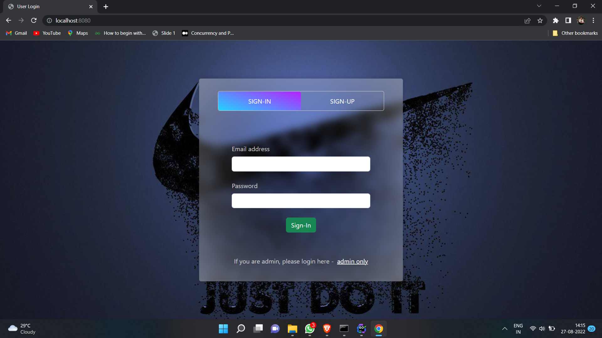
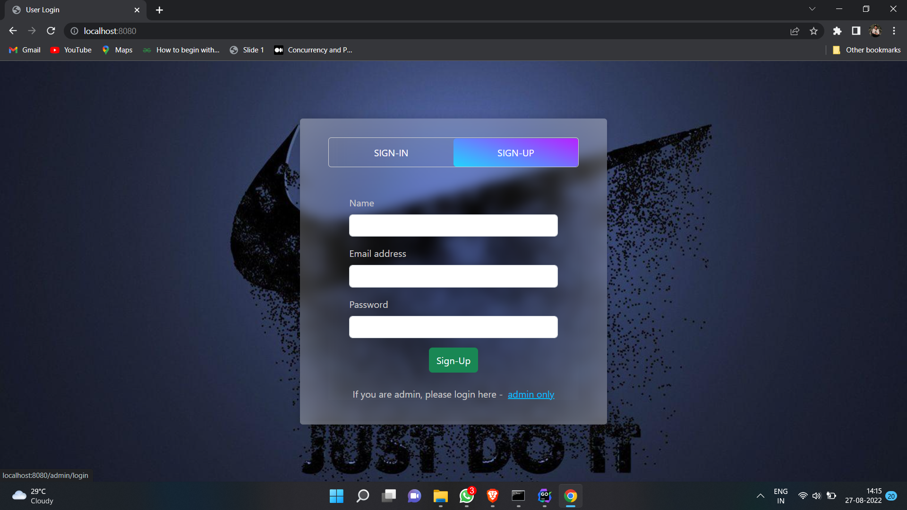
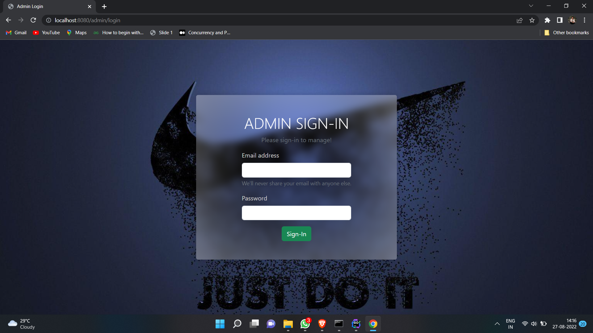
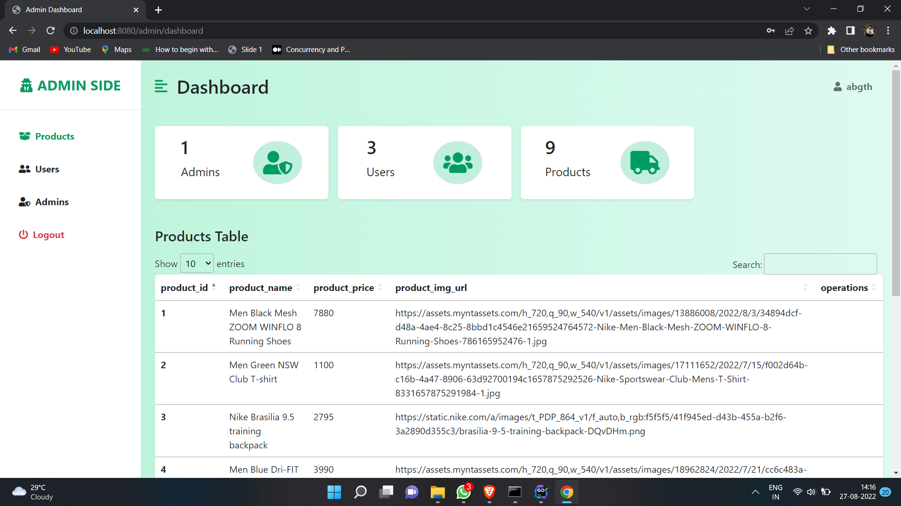
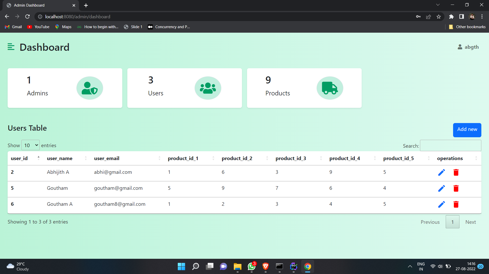

# Authentication using postgres (with session and cookies)
The application contains of a login and register pages for users, and also login page for admin. Both admin and user have a dashboard if only they are logged in. The admin can alter the values of the user and products which user can buy, can create new users, delete users etc.
<br>
The application uses no additional packages like gorm or fiber to ease the developing process. But uses session and cookies to persist the state information between page requests.
<br><br>

## 🔗 API Information
- ### User's routes
- <strong>```localhost:8080/```</strong> - This displays the user's login and register pages
- <strong>```localhost:8080/user/dashboard/```</strong> - This displays the user's dashboard page with user details and products
- <strong>```localhost:8080/user/logout/```</strong> - Visiting this route will logs out the current user
- ### Admin side
- <strong>```localhost:8080/admin/login/```</strong> - This displays the login page of the admin section
- <strong>```localhost:8080/admin/dashboard/```</strong> - This displays the admin dashboard with full details of users, products, and even the admin's
- <strong>```localhost:8080/admin/new-user-form/```</strong> - Provides the form to add a new user to the database
- <strong>```localhost:8080/admin/update-user-form/```</strong> - Provides the form to update an existing user
- <strong>```localhost:8080/admin/logout```</strong> - Logs out the current admin

## ✍ To dos
- [ ] Use JWT instead of session
- [ ] Make user content dynamic

## 📱 Screenshots







## 💻 Test application on your machine
Open CMD from where you want to clone the project & run the following commands:
```
  https://github.com/x-abgth/authentication-using-postgres.git
```
```
  cd authentication-using-postgres
 ```
 ```
  go run main.go
 ```
## ❤ Conclusion
🌟 Star this repo & follow for more 😊